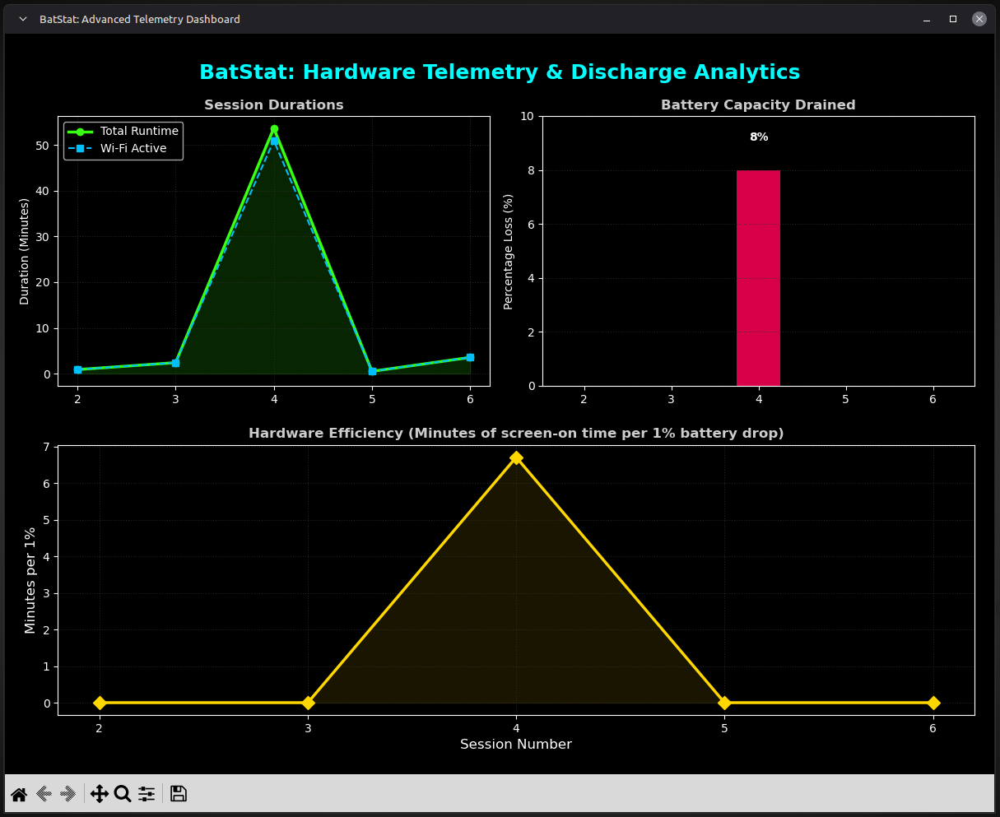

# BatStat: ML-Ready Battery Lifecycle Tracker 🔋

A lightweight, background bash daemon for Linux that tracks real-time laptop battery discharging and charging cycles. Unlike standard battery monitors, BatStat automatically generates a structured CSV dataset of your hardware's power history, designed specifically for analyzing degradation curves or training neural networks. 

It also includes a Python-based Telemetry Dashboard to visualize your hardware efficiency in real-time.

**Author:** Suvojit Ghosh | Ramakrishna Mission Shilpamandira

## ✨ Key Features
* **Persistent Tracking:** Survives system reboots and shutdowns without losing session data.
* **Phase Detection:** Automatically separates metrics into 'Charging' and 'Discharging' phases.
* **Network Polling:** Tracks exactly how long the Wi-Fi interface is active during each power session.
* **Zero-Overhead Daemon:** Runs silently as a user-level `systemd` service with a 1-second polling interval.
* **Machine Learning Ready:** Outputs a clean `battery_history.csv` perfect for predictive modeling.
* **Advanced Telemetry Dashboard:** A dark-themed Python visualizer that calculates battery capacity drain and hardware efficiency (minutes per 1% drop).

## 📸 Screenshots

**Advanced Telemetry Dashboard:**


**Live Terminal Tracking (Discharging & Charging):**


**Automated CSV Data Logging:**


## 🚀 Use Cases
* **Data Science & ML:** Feed the generated CSV into a neural network to model hardware degradation over hundreds of cycles.
* **Offline Travel:** Accurately track active screen-on time and calculate efficiency during long, disconnected trips.

## 🛠️ Installation

**1. Clone the repository:**
```bash
git clone [https://github.com/yourusername/BatStat.git](https://github.com/yourusername/BatStat.git)
cd BatStat

sudo apt update
sudo apt install python3-pandas python3-matplotlib python3-numpy -y

cp src/* ~/.local/bin/
chmod +x ~/.local/bin/*

mkdir -p ~/.config/systemd/user/
cp systemd/battery-tracker.service ~/.config/systemd/user/
systemctl --user daemon-reload
systemctl --user enable --now battery-tracker.service
