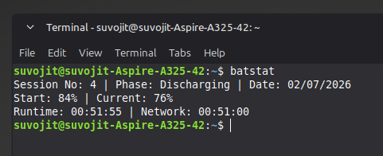
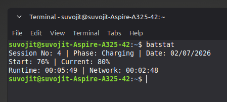
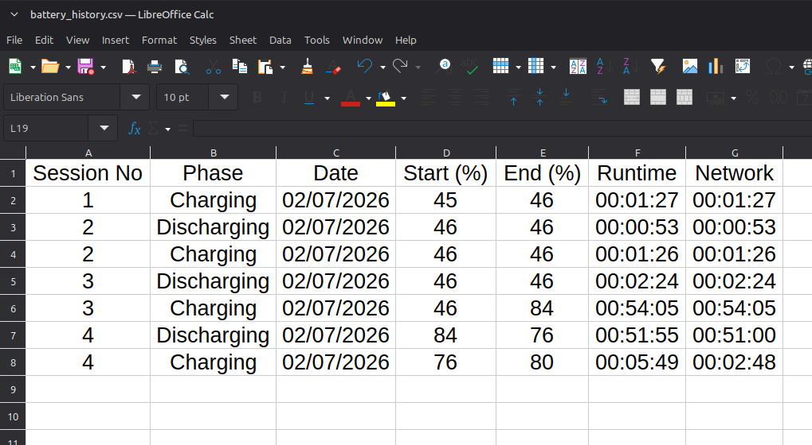

# BatStat: ML-Ready Battery Lifecycle Tracker 🔋

A lightweight, background bash daemon for Linux that tracks real-time laptop battery discharging and charging cycles. Unlike standard battery monitors, BatStat automatically generates a structured CSV dataset of your hardware's power history, designed specifically for analyzing degradation curves or training neural networks.

**Author:** Suvojit Ghosh | Ramakrishna Mission Shilpamandira

## ✨ Key Features
* **Persistent Tracking:** Survives system reboots and shutdowns without losing session data.
* **Phase Detection:** Automatically separates metrics into 'Charging' and 'Discharging' phases.
* **Network Polling:** Tracks exactly how long the Wi-Fi interface is active during each power session.
* **Zero-Overhead Daemon:** Runs silently as a user-level `systemd` service with a 1-second polling interval.
* **Machine Learning Ready:** Outputs a clean `battery_history.csv` (Session No, Phase, Date, Start %, End %, Runtime, Network) perfect for predictive modeling.

## 📸 Screenshots

**Live Terminal Tracking (Discharging & Charging):**



**Automated CSV Data Logging:**


## 🚀 Use Cases
* **Data Science & ML:** Feed the generated CSV into a neural network to model hardware degradation over hundreds of cycles.
* **Offline Travel:** Accurately track active screen-on time during long, disconnected trips (e.g., a 15-hour train journey from Howrah Junction to Guwahati) where standard OS battery estimates fail.

## 🛠️ Installation
1. Clone the repository:
   `git clone https://github.com/yourusername/BatStat.git`
2. Move the scripts to your local bin:
   `cp src/* ~/.local/bin/ && chmod +x ~/.local/bin/*`
3. Install and enable the systemd service:
   `mkdir -p ~/.config/systemd/user/`
   `cp systemd/battery-tracker.service ~/.config/systemd/user/`
   `systemctl --user daemon-reload`
   `systemctl --user enable --now battery-tracker.service`

## 💻 Usage
Simply open your terminal and type `batstat` to view your live phase data:
```text
Session No: 4 | Phase: Charging | Date: 02/07/2026
Start: 20% | Current: 35%
Runtime: 00:25:10 | Network: 00:20:00
